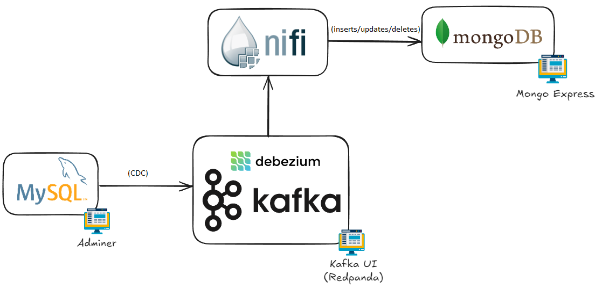

# Real-Time E-Commerce Analytics: End-to-end Project with Data Ingestion, CDC and NOSQL (Optional)

## Introduction

In this exercise, we build an architecture that combines MySQL for transactional data, Debezium for change data capture, Apache NiFi for data processing and routing, and MongoDB for flexible, schema-less storage of data. It provides a robust solution for building real-time data pipelines and analytics applications.

**Business Scenario**: 

An e-commerce platform uses MySQL as their transtactional database to store order (among other things). We want to capture the data in real-time in order to:
* Store it in a NOSQL database (MongoDB) in order to perform analysis and expose the data efficiently.
* Enable the possibility to implement real-time use cases (e.g. alerts, notifications, metrics, etc.)
* Reduce the load (and potentially the cost) in the source database (MySQL)

In this exercise we will only cover partially the first point, i.e. replicate the data to Mongo and perform simple analysis.

## Architecture




- **MySQL**: Stores transactional data on orders.
- **Debezium**: Captures row-level changes in the MySQL database and streams them to Kafka.
- **NiFi**: Processes and routes data from Kafka to MongoDB.
- **MongoDB**: Stores the data in a flexible, schema-less format for real-time analytics.

## Pre-requisites

In this exercise, we will use all the components from the previous exercises. Run the following command to start the required containers:

```shell	
docker compose up -d
```

In any case, given that we will go from MySQL to MongoDB (as in the diagram), you can start the components incrementally. Starting with MySQL and adminer.

Also, before running any python script, make sure you install the requirements (under the `scripts` folder):

```shell	
pip install -r requirements.txt
```

## Exercise

* **MySQL Database:** Set up the MySQL database. Create a new database named `ecommerce_db` and 1 table: `orders`. Insert some sample data into these tables.

  * Login as root/debezium (either in adminer or commandline) and run the `database_init.sql` script.
  * Complete the `orders_simulator.py` and test it.
  * Once confirmed it is creating orders, stop it for the time being.

* **Debezium:** Configure Debezium to capture changes in the MySQL database. Use the `register-mysql.json` file from [Exercise 07](../Exercise07/register-mysql.json) to set up the MySQL connector.

  * Make sure you configure the connector to capture data from the new database and table.
    * Feel free to change the `topic.prefix` as well to differentiate from previous exercises.
  * Remove any existing connectors and load/run the new one.
  * Check in the Kafka UI if the initial data from the table was transferred.
  * Run the `orders_simulator.py` again and confirm that the new messages are arriving to Kafka.
  * **TIP**: You might need this: `"decimal.handling.mode": "double"`. Do not just use it directly, test and understand first why.

* **Apache NiFi:** Create a dataflow in NiFi to consume messages from the Kafka topic, extract fields from the JSON message, and insert the data into MongoDB.

  * Use the following processors:
    * **ConsumeKafka_2_6**: Consume messages from the Kafka topic.
    * **EvaluateJsonPath**: Extract fields from the JSON message.
    * **PutMongo**: Insert the data into MongoDB (database: `ecommerce_db`, collection: `changes_orders`).
  * Update one of the orders (you can do this directly in adminer) and see what happens end-to-end.
    * Change the **PutMongo** processor so it handles updates, and test again.
  * Delete one of the orders and see what happens end-to-end.
    * Create a filter so that we capture deletions and delete the record, using the following components:
      * **EvaluateJsonPath**: To extract the operation.
      * **RouteOnAttribute**: To separate insert/update messages and delete messages.
      * **DeleteMongo**: To delete the entry en MongoDB.
    * **TIP**: You will need a new `EvaluatJsonPath` for deleted messages, since we now get the content from `payload.before` and not `payload.after`.

* **MongoDB:** Verify that the data is being inserted into MongoDB. Connect to the MongoDB container and query the `changes_orders` collection to view the data. Perform some basic queries to analyze the data.

  * Complete the `orders_analysis.py` so that you query MongoDB every 10 seconds and show the following:
    * How many orders were Pending, Shipped, Delivered, or Cancelled.
    * What was the top price order.

# Resources

* **Data:** https://www.kaggle.com/datasets/olistbr/brazilian-ecommerce
* **Debezium (MySQL Connector)**: https://debezium.io/documentation/reference/1.7/connectors/mysql.html
* **Debezium (MySQL Connector) - Handling decimal types**: https://debezium.io/documentation/reference/stable/connectors/mysql.html#mysql-decimal-types
* **Apache NiFi (MongoDB processors)**: https://nifi.apache.org/docs/nifi-docs/components/org.apache.nifi/nifi-mongodb-nar/1.14.0/org.apache.nifi.processors.mongodb.PutMongo/index.html
* **MongoDB (Query operators)**: https://www.mongodb.com/docs/manual/reference/operator/query/
