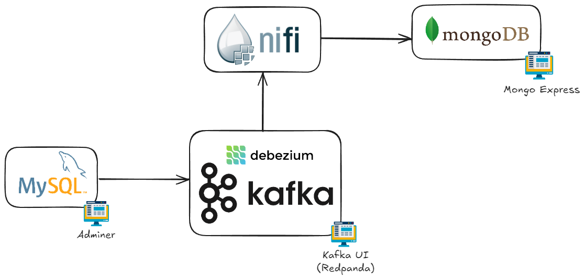

# EDEM - Master Big Data and Cloud - Data Ingestion and NOSQL

Exercises for the "Introduction to Data Ingestion and NOSQL" class at EDEM.
In this course we learn how to ingest data using [Apache NiFi](https://nifi.apache.org/) and CDC ([Debezium](https://debezium.io/)), and how to store it in [MongoDB](https://www.mongodb.com/).

## Introduction

Throughout these three sessions (Data Ingestion with NiFi, CDC with Debezium, and NoSQL with MongoDB), we will work through a series of interconnected exercises. By the end, we will have completed an end-to-end project that integrates all the components.

We'll begin by using Apache NiFi to ingest data and store it in MongoDB. Next, we'll explore real-time data ingestion from databases using Debezium. Finally, we'll dive deeper into MongoDB, performing queries, setting up indexes, and more.

## Initial Setup

We will be using the Docker Compose in this root folder. Let's start by downloading all the services (images):

```shell
docker compose pull
```

Find below the list components which we will be using:

| Component  | Description | Docker Service | Port | Credentials |
| ------------- | ------------- | ------------- | ------------- | ------------- |
| **Apache NiFi**  | Data flow and integration tool | nifi  |  [8443](https://localhost:8443/nifi) | admin / ctsBtRBKHRAx69EqUghvvgEvjnaLjFEB |
| **Kafka** | Distributed event streaming platform | kafka | 9092 | N/A |
| **Zookeeper** | Coordination service for Kafka and other distributed systems | zookeeper | 2181, 2888, and 3888 | N/A |
| **Kafka Connect** | Tool for scalable and reliable data streaming between Kafka and other systems | connect | 8083 | N/A |
| **Kafka UI** | Web UI to manage Kafka topics and consumer groups | redpanda-console | [9000](http://localhost:9000/) | N/A |
| **MySQL** | Relational database management system | mysql | 3306 | Debezium: mysqluser / mysqlpw <br/> Admin: root / debezium |
| **Adminer (MySQL UI)** | Web-based database management tool | adminer | [8090](http://localhost:8090/) | *Ditto* |
| **MongoDB** | NoSQL database system | mongo | 27017 | root / example |
| **MongoDB Express - UI** | Web-based MongoDB administration tool | mongo-express | [8081](http://localhost:8081/) | admin / pass |

Here is a view of the architecture we will be using:



## Exercises

Here is the list of exercises we will follow:

* [**Exercise 1**: NiFi - Building our first Data Flow - File to File](Exercises/Exercise01)
* [**Exercise 2**: NiFi - Basic Ingestion (I) - HTTP to File](Exercises/Exercise02)
* [**Exercise 3**: NiFi - Basic Ingestion (II) - HTTP to File, with data manipulation](Exercises/Exercise03)
* [**Exercise 4**: NiFi - Complex Data Ingestion - Real-time Flights](Exercises/Exercise04)
* [**Exercise 5**: NiFi - GDELT Data Ingestion (Optional)](Exercises/Exercise05)
* [**Exercise 6**: NiFi - Ingesting real-time data (Optional)](Exercises/Exercise06)
* [**Exercise 7**: Debezium - Setup](Exercises/Exercise07)
* [**Exercise 8**: Debezium - Basic Change Data Capture](Exercises/Exercise08)
* [**Exercise 9**: Debezium - Advanced Change Data Capture](Exercises/Exercise09)
* [**Exercise 10**: Debezium - Data Transformations with SMT (Optional)](Exercises/Exercise10)
* [**Exercise 11**: MongoDB - Basic Querying](Exercises/Exercise11)
* [**Exercise 12**: MongoDB - Advanced Querying](Exercises/Exercise12)
* [**Exercise 13**: MongoDB - Aggregations & Projections](Exercises/Exercise13)
* [**Exercise 14**: MongoDB - Indexes](Exercises/Exercise14)
* [**Exercise 15**: Neo4j - Demo](Exercises/Exercise15)
* [**Exercise 16**: End-to-end Project: Data Ingestion, CDC and NOSQL](Exercises/Exercise16)

 **Optional exercises** are more advanced, and will be done during the class if we have time. Otherwise they will optional for the trainee to do as homework.

# Cluster administration

Here are some useful commands you might need:

```shell
# Launch all services for the first time
docker compose up -d
```

```shell
# Shut down and destroy the cluster
docker compose down
```

```shell
# Start a specific service
docker compose start <SERVICE>
```

```shell
# Stop a specific service
docker compose stop <SERVICE>
```

```shell
# List the running services
docker ps
```

# Authors

This course and exercises were created by:

* [Franzi Kröger](https://github.com/frkroe)
* [Esteban Chiner](https://github.com/echiner)